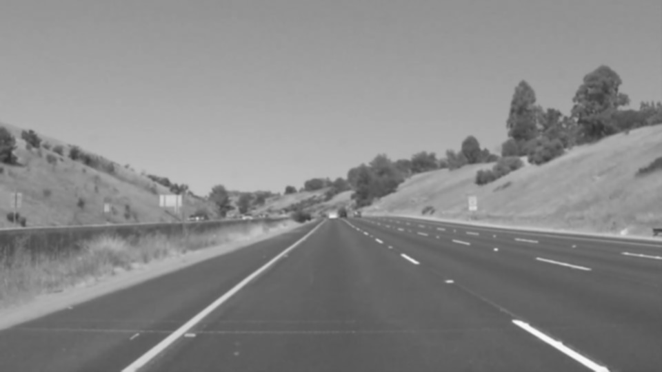
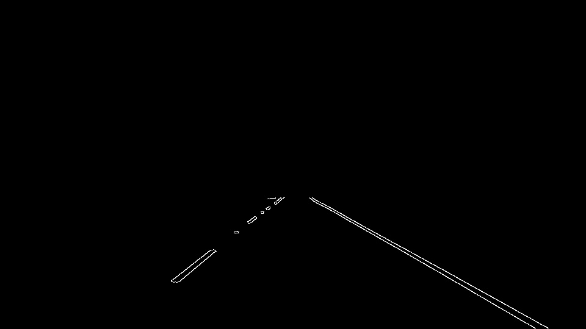
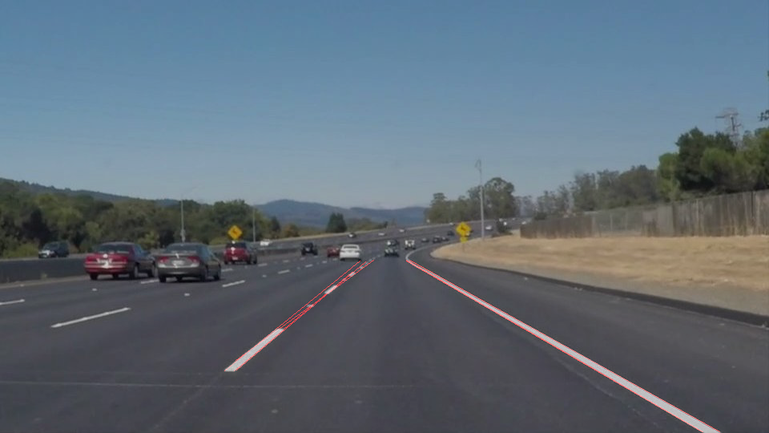
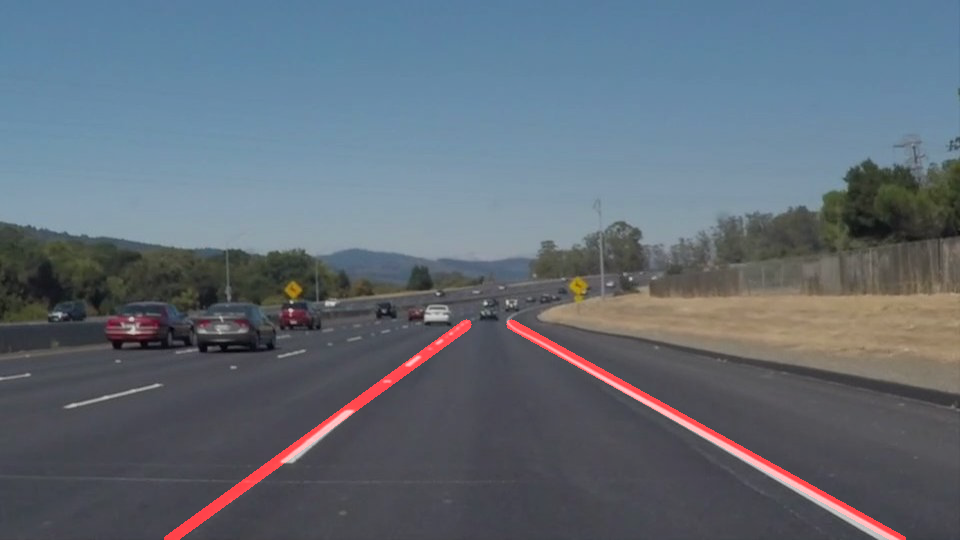

# **Finding Lane Lines on the Road** 

[](http://www.udacity.com/drive)

This Udacity Self-Driving Car NanoDegree project is to find lane lines on the road images using traditional computer vision methods such as edge detection and line detection. A well-known computer vision library, OpenCV, is used for implementation. This projet is detecting lane line from a road image, but also from a road video clip.

---

## Pipeline for finding lane lines on the road image


### Step 1. Transforming an RGB colored road image into gray scale

The first step in the lane line detection pipeline is to transform the RGB color image into a gray scale image so that canny edge detection could be applied. For the image transform, cvtColor function of OpenCV is used.

```
cv2.cvtColor(img, cv2.COLOR_RGB2GRAY)
```

The transformed image of the original road image is like th below:


### Step 2. Applying Gaussian smoothing

Gaussian smoothing is applied in order to suppresse noise and spurious gradients by averaging. In this project, kernel size of 5 is used. 

> Note: OpenCV's Canny Edge Detection function, Canny(), applies Gussian smoothing internally, but the kernel parameter is not chaneable in Canny() function. 

````
cv2.GaussianBlur(img, (kernel_size, kernel_size), 0)
````

Refer to [OpenCV GaussianBlue document](https://docs.opencv.org/2.4/modules/imgproc/doc/filtering.html?highlight=gaussianblur#gaussianblur) for the detail.



### Step 3. Detecting edges using Canny Edge Detection algorithm

Canny edge detection algorithm is then applied. OpenCV provides this algorithm as a function, Canny(). Two threshold parameters are specified. 

````
cv2.Canny(img, low_threshold, high_threshold)
````

> **How are threshold parameters used?**
> 
> The algorithm will first detect strong edge (strong gradient) pixels above the high_threshold, and reject pixels below the low_threshold. Next, pixels with values between the low_threshold and high_threshold will be included as long as they are connected to strong edges.


### Step 4. Filtering out edges which are outside of an interested region

As seen the above, it will detect all the edges of the image while we are only interested in edges of lanes. Assuming the camara is mounted in the vehicle, lanes within road images should be within a certain region. So, we can cut out all the other edges which are outside of the region. This is done in two steps;

1. Creating an empty image, and coloring the defined region
2. Applying bit-wise AND operation on the original image and the masking image created

````python
def region_of_interest(img, vertices):
    """
    Applies an image mask.
    
    Only keeps the region of the image defined by the polygon
    formed from `vertices`. The rest of the image is set to black.
    """
    #defining a blank mask to start with
    mask = np.zeros_like(img)   
    
    #defining a 3 channel or 1 channel color to fill the mask with depending on the input image
    if len(img.shape) > 2:
        channel_count = img.shape[2]  # i.e. 3 or 4 depending on your image
        ignore_mask_color = (255,) * channel_count
    else:
        ignore_mask_color = 255
        
    #filling pixels inside the polygon defined by "vertices" with the fill color    
    cv2.fillPoly(mask, vertices, ignore_mask_color)
    
    #returning the image only where mask pixels are nonzero
    masked_image = cv2.bitwise_and(img, mask)
    return masked_image
````

The below image is the result of this masking task.

> Note: The chanllenge is how to define the masking region correctly; not too wide nor too narrow.



### Step 5. Detecting lines using Hough Transform altorithm

The lines obtained upto the Step 4 are not all solid ones. The most left and right lanes are solid, but others in the middle are not. **Probabilistic Hough Transform** algorithm, *cv2.HoughLinesP()*, is then applied to connect the line segments.

https://docs.opencv.org/2.4/modules/imgproc/doc/feature_detection.html#houghlinesp

````python
lines = cv2.HoughLinesP(img, rho, theta, threshold, np.array([]), minLineLength=min_line_len, maxLineGap=max_line_gap)
````

Parameters are;

* image – 8-bit, single-channel binary source image. The image may be modified by the function.  
* rho – Distance resolution of the accumulator in pixels.
* theta – Angle resolution of the accumulator in radians.
* threshold – Accumulator threshold parameter. Only those lines are returned that get enough votes (> threshold).
* minLineLength – Minimum line length. Line segments shorter than that are rejected.
* maxLineGap – Maximum allowed gap between points on the same line to link them.

, and the result value is an output vector of lines. Each line is represented by a 4-element vector (x_1, y_1, x_2, y_2) , where (x_1,y_1) and (x_2, y_2) are the ending points of each detected line segment.

> Refer to [Hough Line Transform](https://docs.opencv.org/2.4/doc/tutorials/imgproc/imgtrans/hough_lines/hough_lines.html?highlight=hough%20transform) for the algorithm description



### Step 6. Drawing left and right lane lines among ones found from the previous step

Even though lanes are solid, lane lines might be partial which means that the lane line might end up in the middle. See the left lane line. This is an expected result from Hough Transform because there is no line segment of the left lane at the bottom. Another thing to be addresses is that lane are rectangles not a single line, which is also expected. To address these two, the final lane line drawing function does;

1. to ignore line segments whose absolute slose is less than 0.5
2. to find the ending points of each lanes (top and bottom point of left and right lane)
3. to calculate the slope of each so that the end point at the botoom of each lane could be calculated
4. to draw a solid thick line for the left and right lane




---

## Potential **shortcomings** with this pipeline

In order to fit this pipeline to the sample images and video clips, I modified parameters used within this pipeline, and applied rules to exclude line segments which I think are not part of lanes. So, this approach has potential shortcoming in several situatations.

#### Lanes outside of the predefined interest region

A predefined region is used to mask out detected edges assuming lanes will be within that region. However, if the car is not in the middle of the left and right lane, either left or right lane could be outside of the region. In this case, only single lane will be detected. Also, if there is a sharp curve, detected lane might be too short.

#### Erased but still visiable old lanes
If there is a wall nearby the lane, the edge of the wall could be considered as an lane. 

## Possible **improvements** to this pipeline

#### Adaptive interesting region modification

Adjusting the masking region depending on the number of lanes found could make this pipeline more robust rather than using the fixed and pre-defined region all the time. Also, the region can be modified to reflect the horizontal line.

#### Applying deep learning technology to learn from data not to manually fit the model